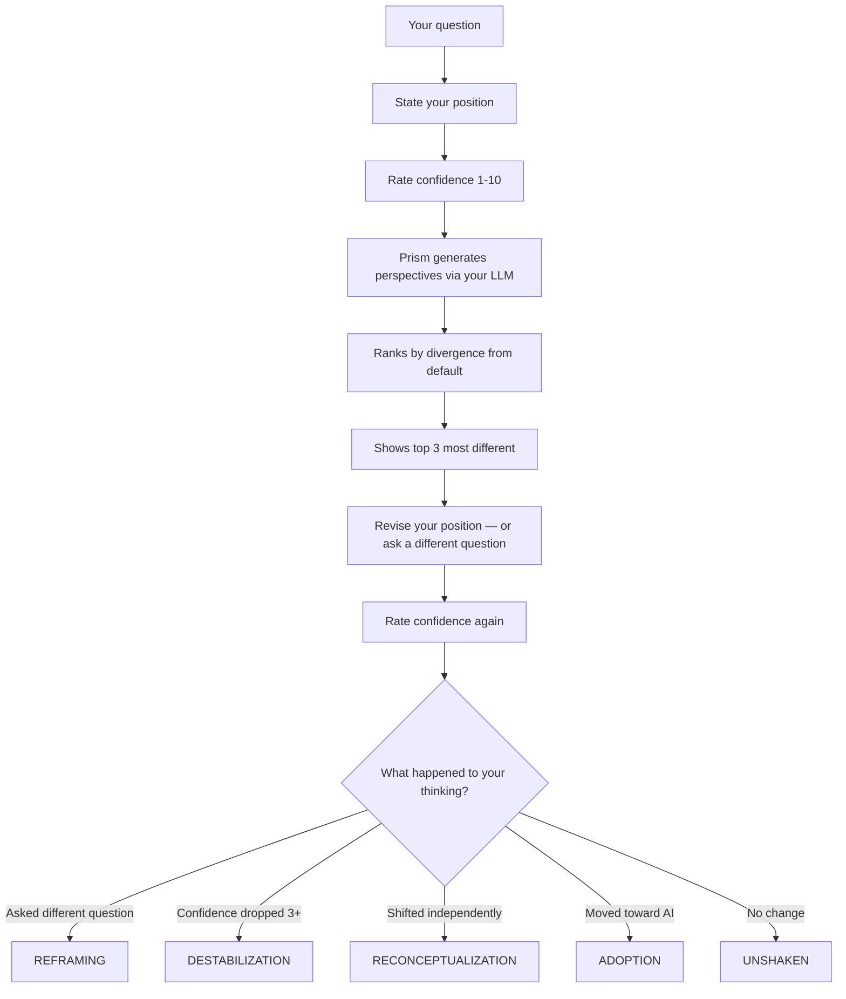

# Prism

**See how AI is changing how you think — before you realize it.**

[](https://www.python.org/downloads/)
[](LICENSE)
[](#get-started)

---

## What This Is

Every time you ask an AI a question, the answer reshapes how you think about the problem — your framing, your confidence, your sense of what matters. You don't notice. Nobody does. The response sounds reasonable, the process felt rigorous, so you accept the frame and move on.

**Prism makes this visible.**

It forces you to state your position and confidence *before* seeing any AI output. Then it generates structurally different perspectives (not just rephrasing — structural constraints backed by cognitive science). Then it asks you again. The difference between your before and after — your confidence change, whether you reframed the question, whether you drifted toward the AI's default — tells you something no other tool measures: **how much is AI shaping your thinking, and are you aware of it?**

> [!IMPORTANT]
> **This is not a better way to get AI answers.** If you want better AI outputs, use multi-agent systems, RAG pipelines, chain-of-thought — there are excellent tools for that ([LLM Council](https://github.com/karpathy/llm-council), [llm-consortium](https://github.com/irthomasthomas/llm-consortium), [STORM](https://github.com/stanford-oval/storm)). Prism is a **measurement instrument**. The perspectives are the experiment. The finding is what happens to *you*.

---

## Why This Matters

You type a research question. An AI gives you an elaborate, well-structured answer. Maybe multiple agents debated it. Maybe it searched the web and cited papers. You think: "that was thorough." But:

- The AI agreed with your framing [49% more than a human would](https://news.stanford.edu/stories/2026/03/ai-advice-sycophantic-models-research) (Science, 2026)
- You rated its answer as more trustworthy *because* it agreed with you
- AI-generated ideas [look novel individually but converge at population level](https://arxiv.org/abs/2409.04109) — only 5% unique from 4,000 generated
- After using AI, people produce [narrower ideas and think less critically](https://www.microsoft.com/en-us/research/blog/the-future-of-ai-in-knowledge-work-tools-for-thought-at-chi-2025/) (Microsoft CHI 2025)
- Students with AI access performed better during practice but [worse on independent tests](https://arxiv.org/abs/2404.10730) — a dependency effect (Bastani et al. 2024, n=1000+)

The AI didn't make you think better. It made you think *its way*. And the longer the process looked, the more you trusted the result.

Prism is the before/after measurement that reveals this.

---

## Get Started

### 1. Clone and configure

```bash
git clone https://github.com/kirti34n/prism.git && cd prism

# Set your LLM (pick one):
export OPENAI_API_KEY=sk-...        # OpenAI
export ANTHROPIC_API_KEY=sk-...     # Claude
# OR just have Ollama running       # Local (auto-detected)
```

Zero dependencies. Python 3.7+ and an LLM. Nothing else needed.

> [!TIP]
> `pip install sentence-transformers` upgrades measurement from lexical (word overlap) to semantic (384D embeddings). Optional — everything works without it.

### 2. Install globally and integrate

```bash
# Make 'prism' available as a command everywhere
python3 prism.py setup install

# Integrate with your AI tools (pick any, or all)
prism setup claude     # Claude Code — adds /prism and /prism-check commands
prism setup codex      # Codex CLI
prism setup cursor     # Cursor (run in your project dir)
prism setup copilot    # GitHub Copilot
prism setup windsurf   # Windsurf (run in your project dir)
prism setup all        # install + claude + codex + copilot at once
```

No server. No daemon. Setup creates config files that teach each AI tool to call `prism` as a shell command.

> [!NOTE]
> After `setup claude`, **restart Claude Code** to pick up new slash commands. Or use `! prism check "conclusion"` which works immediately without restart.

### 3. Use it

```bash
prism "Is my hypothesis falsifiable?"
```

---

## Usage

### Standalone (terminal)

```bash
# Full loop: state position → see perspectives → revise → measure shift
prism "Does correlation imply causation in my dataset?"

# Challenge an AI conclusion before you commit to it
prism check "The model says microservices because of scalability"

# Just show perspectives, no measurement
prism quick "Should I use mixed methods?"

# Random research prompt
prism think

# Your thinking patterns over time
prism insights

# Recent sessions
prism history

# Configuration
prism config provider openai
prism config strategies "pre_mortem,falsification,blind_spot"

# Machine-readable output (for scripts and integrations)
prism json "your question"
prism json --check "AI conclusion"
```

### Inside AI tools

**Claude Code:**
```
/prism Is my hypothesis falsifiable?
/prism-check The data shows correlation therefore causation
```

**Codex / Copilot / Cursor / Windsurf:**
Ask your AI: "challenge this conclusion using prism" or "get prism perspectives on X" — the setup instructions teach the AI to run the command.

---

## Examples

### `prism explore` — the full measurement loop

```
$ prism "Does social media cause depression in teenagers?"

  PRISM
  ========================================================
  Does social media cause depression in teenagers?
  ========================================================

  Your position (before seeing anything):
  > Yes, the evidence from multiple studies shows a clear link
  Confidence (1-10): 8

  Generating perspectives (openai/gpt-4o-mini)...
  [1/5] Default — done
  [2/5] Pre-Mortem — done
  [3/5] Blind Spot — done
  [4/5] First Principles — done
  [5/5] Systems — done

  ────────────────────────────────────────────────────────
  DEFAULT ANSWER
  ────────────────────────────────────────────────────────
    Social media can contribute to depression in teenagers, but it is
    not the sole cause. Research suggests a complex relationship where
    factors like cyberbullying, social comparison, and exposure to
    unrealistic standards may increase feelings of anxiety and low
    self-esteem. However, the impact varies by individual...

  ────────────────────────────────────────────────────────
  1. SYSTEMS (distance: 0.172)
  ────────────────────────────────────────────────────────
    Second-order: Increased depression leads to heightened isolation
    and reduced real-world social engagement.
    Third-order: Prolonged isolation undermines development of emotional
    resilience and coping skills, making teens vulnerable to chronic
    mental health struggles persisting into adulthood.
    Fourth-order: A generation with diminished resilience faces reduced
    workforce productivity, higher healthcare costs, and strained
    interpersonal relationships.

  ────────────────────────────────────────────────────────
  2. BLIND SPOT (distance: 0.126)
  ────────────────────────────────────────────────────────
    Most people assume a direct causal link, ignoring the bidirectional
    nature: teens already struggling with mental health may use social
    media more to cope, creating a feedback loop. Factors like
    socioeconomic status and family dynamics mediate the impact but are
    rarely considered in simplistic narratives.

  ────────────────────────────────────────────────────────
  3. FIRST PRINCIPLES (distance: 0.112)
  ────────────────────────────────────────────────────────
    Assumption 1: "Social media is inherently harmful." What if it's a
    tool whose impact depends on how it's used?
    Assumption 2: "The link is direct and causal." What about reverse
    causation — depressed teens using social media more to cope?
    Assumption 3: "All platforms have the same impact." Instagram's
    visual focus vs Reddit's forums produce very different effects.

  ────────────────────────────────────────────────────────
  Same position? Changed? Or a different question entirely:
  > What factors mediate the relationship between social media use and teen mental health?
  Confidence (1-10): 5

  ========================================================
  MEASUREMENT (semantic)
  ========================================================

  Session: reframing
  You asked a different question — frame shift
  Confidence: 8 → 5 (-3)
  Text shift: 0.4231
  Direction: independent
  Independence: 78%

  Most useful? (1=Systems, 2=Blind Spot, 3=First Principles, Enter to skip)
  > 2

  Session logged. Run 'prism insights' for patterns.
```

The user started confident (8/10) that social media causes depression. After seeing the Blind Spot perspective (bidirectional causation), they **reframed the question entirely** and their confidence dropped to 5. Prism classified this as the deepest type of shift: **reframing**.

---

### `prism check` — challenge an AI conclusion

```
$ prism check "LLMs understand meaning because they generate coherent text"

  PRISM — Challenge
  ========================================================
  LLMs understand meaning because they generate coherent text
  ========================================================

  ────────────────────────────────────────────────────────
  PRE-MORTEM
  ────────────────────────────────────────────────────────
    The core failure: conflating surface-level pattern recognition with
    semantic comprehension. The model generates text that sounds meaningful
    but lacks grounding in factual knowledge or causal reasoning. The
    "hallucination problem" — systematic fabrication of information —
    was dismissed as edge cases despite being ubiquitous.

  ────────────────────────────────────────────────────────
  ALT HYPOTHESIS
  ────────────────────────────────────────────────────────
    1. Statistical pattern matching: coherence from learned regularities,
       not comprehension. Test: does it fail tasks requiring reasoning?
    2. Emergent syntactic regularity: grammatically correct but semantically
       hollow. Test: does it produce correct-sounding nonsense?
    3. Internal representations: actual abstract concepts encoded in
       weights. Test: can it reason about novel scenarios?

  ────────────────────────────────────────────────────────
  BLIND SPOT
  ────────────────────────────────────────────────────────
    Coherence and fluency are not understanding. People see a model write
    an essay on quantum physics and assume it "gets" the content, ignoring
    the lack of causal reasoning or semantic depth. The output is mimicry
    of patterns, not comprehension of meaning.

  Does the conclusion still hold?
```

Three challenges, each from a different angle. No before/after measurement — just sharp challenges to read before you commit to the conclusion.

---

### `prism insights` — patterns over time

```
$ prism insights

  PRISM — Insights
  ────────────────────────────────────────
  Sessions: 14

  Session types:
           destabilization: 5  (doubt)
              reconceptualization: 3  (new thinking)
                reframing: 2  (frame shift)
                 adoption: 2  (toward AI)
                 unshaken: 2  (no change)

  Confidence change: -1.8 average (14 measured)
    Prism is creating productive doubt

  What challenges you (deep shift rate):
            Pre-Mortem:  80% (5 sessions) |################|
            Blind Spot:  60% (5 sessions) |############|
         Falsification:  50% (4 sessions) |##########|
        Adjacent Field:  33% (3 sessions) |######|
       Devil's Advocate: 25% (4 sessions) |#####|

  Independence: 64% average

  Convergence (last 14 sessions):
    DIVERGING (slope: 0.0187) — increasingly independent
```

After 14 sessions: Pre-Mortem is the strategy that challenges this user most (80% deep shift rate). Average confidence drops 1.8 points per session — productive doubt. The user is diverging from AI defaults over time.

---

## How It Works



### The `check` command

For the moment after you've done AI-assisted research and are about to commit:

```bash
prism check "The literature suggests X causes Y based on correlation studies"
```

Generates 4 targeted challenges — **Pre-Mortem** (how this fails), **Alt Hypothesis** (3 other explanations), **Falsification** (what would disprove it), **Blind Spot** (what everyone misses). No before/after measurement — just sharp challenges.

---

## What Prism Measures

> [!NOTE]
> The goal is not to provide better AI answers. The goal is to make visible how AI's default response is already shaping your thinking — your framing, your confidence, your assumptions — without you realizing it.

### Session types

Each session is classified by what happened to your thinking:

| Type | What happened | What it means |
|---|---|---|
| **Reframing** | You asked a different question entirely | Deepest shift — your frame changed, not just your answer |
| **Destabilization** | Confidence dropped significantly | Productive doubt — a held belief was shaken |
| **Reconceptualization** | Position changed in an independent direction | Genuine new thinking — you went somewhere the AI didn't point |
| **Adoption** | Moved toward a model response | Caution — you may have absorbed the AI's frame |
| **Unshaken** | No change in position or confidence | The perspectives didn't land — or you were already well-calibrated |

### What's tracked

- **Confidence delta**: 1-10 before and after. One keystroke. The single highest-signal measure of real thinking change.
- **Text shift**: How far your words moved (lexical or semantic depending on what's installed)
- **Direction**: Did you move toward a perspective, toward the default, or into independent territory?
- **Session type**: The classification above — based on confidence + text + direction together

### Over time (`prism insights`)

- **Session type distribution**: Are you mostly reframing (good) or mostly adopting (concerning)?
- **Confidence trends**: Is Prism creating productive doubt, or increasing false confidence?
- **Strategy effectiveness**: Which perspectives actually challenge YOUR thinking — ranked by deep shift rate
- **Convergence tracking**: Are you moving closer to AI defaults over time? (the sycophancy detector)

---

## 10 Perspective Strategies

<details>
<summary><b>View all strategies with research evidence</b></summary>

Not role-playing ("pretend you're a contrarian"). **Structural constraints** backed by cognitive science that force genuinely different output shapes from a single LLM.

### General

| Strategy | What it forces | Evidence |
|---|---|---|
| **Devil's Advocate** | Argue AGAINST the common position. No hedging. | Lord, Lepper & Preston 1984 — "consider the opposite" outperforms "be fair" instructions (which do nothing) |
| **Blind Spot** | Name exactly ONE thing everyone misses | — |
| **First Principles** | List assumptions, negate each, rebuild | Koriat 1980 — counterargument generation calibrates confidence |
| **Inversion** | Answer the exact opposite question | Mussweiler 2000 — eliminates anchoring in expert judgment |
| **Systems** | Only second and third-order effects | — |
| **Stakeholder** | Write ONLY from who gets hurt | Galinsky & Moskowitz 2000 — perspective-taking reduces bias on conscious and unconscious measures |

### Research-specific

| Strategy | What it forces | Evidence |
|---|---|---|
| **Pre-Mortem** | "This has already failed. The failure was predictable. Why?" | Klein 2007 — prospective hindsight generates 30% more failure reasons, significantly reduces overconfidence (Veinott 2010, n=178) |
| **Alt Hypothesis** | 3 structurally different explanations for the same evidence | Hirt & Markman 1995 — *any* plausible alternative triggers a debiasing simulation mindset |
| **Falsification** | What specific result would disprove this entirely? | Tetlock 2015 — superforecasters are 60% more accurate than intelligence analysts with classified data; this is their core habit |
| **Adjacent Field** | How would a completely different field frame this problem? | Uzzi et al. 2013 (Science, 17.9M papers) — papers with atypical field combinations are 2x more likely to be highly cited |

</details>

**Two modes:**
- **Auto** (default): System learns which strategies shift YOUR thinking most. Weighted selection with random exploration.
- **Manual**: `prism config strategies "pre_mortem,falsification,blind_spot"` — predictable and cheaper.

---

## Does This Work for Complex Queries?

Honest answer: **partially.**

**What works at any complexity level:**
- **Forcing articulation** — stating your position clearly before seeing AI is valuable whether the question is simple or frontier research
- **Confidence tracking** — knowing your confidence went from 8 to 5 is meaningful regardless of domain
- **Pre-mortem and falsification** — these challenge the FRAME, not the content, so they work even when the LLM doesn't deeply understand your niche
- **The measurement** — knowing you drifted toward the AI default is valuable at any complexity

**What doesn't scale as well:**
- **Perspective quality** — for cutting-edge research, the LLM may generate textbook-level challenges, not frontier-level ones
- **Adjacent field suggestions** — may be superficial for highly specialized topics
- **Alternative hypotheses** — may be obvious to domain experts

> [!WARNING]
> Prism's perspectives come from the same kind of model that gave you the default answer. Structural constraints force different output shapes, but the underlying reasoning shares the same training data and RLHF patterns. Prism reveals the influence — it doesn't fully escape it.

---

## Configuration

<details>
<summary><b>Full configuration reference</b></summary>

### Config hierarchy

```
.prism.json (project)  →  ~/.config/prism/config.json (global)  →  auto-detect
```

Project config overrides global. Both override auto-detection.

### Global: `~/.config/prism/config.json`

```json
{
  "provider": "openai",
  "model": "gpt-4o-mini",
  "temperature": 0.7
}
```

### Project: `.prism.json`

```json
{
  "strategies": ["pre_mortem", "falsification", "adjacent_field"],
  "num_perspectives": 3,
  "temperature": 0.9
}
```

### Providers

```bash
prism config provider ollama          # Local
prism config provider openai          # OpenAI
prism config provider anthropic       # Claude
prism config provider gemini          # Gemini
prism config provider openrouter      # OpenRouter
prism config provider custom          # Any OpenAI-compatible
prism config endpoint http://host:1234/v1
```

### Strategy selection

```bash
prism config strategies auto       # system learns what works for you
prism config strategies "pre_mortem,falsification,blind_spot,inversion"
```

Available: `devils_advocate`, `blind_spot`, `first_principles`, `inversion`, `systems`, `stakeholder`, `pre_mortem`, `alternative_hypothesis`, `falsification`, `adjacent_field`

</details>

---

## Using Prism Well

1. **Use it before you've committed** to an approach — cognitive flexibility is highest early
2. **State your position honestly** — self-explanation works best with honest attempts, not performance ([Chi 1989](https://onlinelibrary.wiley.com/doi/10.1207/s15516709cog1803_3))
3. **Watch your confidence** — if it always goes UP after perspectives, you're probably anchoring to the AI
4. **Use `check` after AI research** — the longer the AI process, the more you need to challenge the conclusion
5. **Reframing is the deepest signal** — if you find yourself asking a different question, the perspectives worked
6. **"Adoption" is the warning sign** — if you consistently move toward model responses, you're reading and absorbing rather than thinking

---

## Research Foundation

<details>
<summary><b>Evidence base and honest caveats</b></summary>

| Design decision | Research | What it found |
|---|---|---|
| Think before seeing AI | Chi et al. 1989 (d > 0.8) | Self-explanation improves understanding; must generate, not receive |
| Structural constraints, not roles | Lord, Lepper & Preston 1984 | "Consider the opposite" works; "be fair and unbiased" does nothing |
| Confidence tracking | Hasan et al. (CRI) | Answer + confidence together distinguishes misconception from ignorance from genuine understanding |
| Frame-change detection | Vosniadou (conceptual change) | Genuine change generates new questions, not just new answers |
| Pre-mortem strategy | Klein 2007, Veinott 2010 (n=178) | Prospective hindsight generates 30% more failure reasons, reduces overconfidence |
| Alternative hypothesis | Hirt & Markman 1995 | Any plausible alternative triggers debiasing simulation mindset |
| Falsification probe | Tetlock 2015 (Superforecasting) | Best forecasters are 60% more accurate; falsification is their key habit |
| Adjacent field exposure | Uzzi 2013 (Science, 17.9M papers) | Atypical combinations produce 2x citation impact |
| Divergence ranking | Anti-sycophancy (Stanford 2026) | Select for MAX divergence from default to counter agreement bias |
| Friction by design | Bastani et al. 2024 (n=1000+) | AI access improved practice performance, worsened independent test performance |

### What the research says AGAINST this approach

- **Self-tracking rarely changes behavior** — fitness tracker RCTs show negative results at 24 months (Jakicic 2016, JAMA, n=471). Prism's insights may not drive lasting change.
- **Single-model perspectives share priors** — structural constraints produce output-shape divergence, but the reasoning comes from one set of weights with one training distribution.
- **Reading AI text is passive** — Chi's work argues for generation over reception. The before/after input is active; reading perspectives is passive consumption.
- **AI ideas homogenize at scale** — individual outputs look novel, but across users, everyone gets steered toward similar frames (Doshi & Hauser 2024, Science Advances, n=293).
- **Effect durability unknown** — most perspective-taking research measures immediately after the intervention. Whether thinking stays changed is underresearched.
- **Perspective quality is LLM-limited** — for cutting-edge research, the model may not know enough to generate genuinely challenging alternatives.

</details>

---

## Status

This is a side project, built and improved in free time. The code is minimal, the scope is deliberately narrow, and there are no plans to turn this into a product or service.

But the findings are real. If you use Prism for a few sessions and look at your insights, you'll see patterns in how AI is shaping your thinking — your confidence changes, your tendency to adopt or resist AI framing, which types of challenges actually move you. That data is yours, it stays on your machine, and it tells you something no other tool measures.

Contributions, feedback, and research collaborations welcome.

---

## Philosophy

Born from [SPARK](https://github.com/kirti34n/spark) — 18 versions of testing computational creativity tools. Every version proved: scaffolds don't work, evolution converges, multi-model disagreement is mostly style not substance.

But one thing was never measured: **what does the AI's default response do to the human asking the question?**

Not what the AI outputs. What happens to *you*.

Prism measures that.

---

## License

MIT
