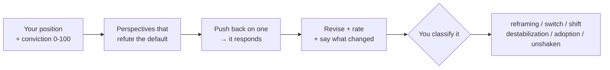

<div align="center">

# 🔺 Prism

**A decision journal for the AI era.**

Record what you thought *before* and *after* consulting an AI, get evidence-based
counterarguments to the AI's default answer, and watch your own trajectory over time.

[](https://github.com/kirti34n/prism/actions/workflows/test.yml)
[](https://www.python.org/downloads/)
[](LICENSE)
[](#-install)

</div>

---

> [!IMPORTANT]
> Prism does **not** psychometrically measure your mind, and it is **not** a better
> way to get AI answers. It is a decision journal with a built-in devil's advocate.
> It measures your own self-report; it can't read your beliefs out of your text.
> Read **[LIMITATIONS.md](LIMITATIONS.md)** before you trust any number it shows you -
> that honesty is the whole point.

## Contents

- [Why this exists](#-why-this-exists)
- [Install](#-install)
- [A session, start to finish](#-a-session-start-to-finish)
- [Commands](#-commands)
- [What it measures (and what it doesn't)](#-what-it-measures-and-what-it-doesnt)
- [The 10 perspective strategies](#-the-10-perspective-strategies)
- [Add it to your AI tools](#-add-it-to-your-ai-tools)
- [The evidence behind the redesign](#-the-evidence-behind-the-redesign)
- [Configuration](#-configuration)

---

## 🧭 Why this exists

Every time you ask an AI a question, the answer reshapes how you think about the
problem: your framing, your confidence, your sense of what matters. You rarely
notice. The response sounds reasonable, the process felt rigorous, so you accept the
frame and move on.

Prism makes that visible. It asks for **your position and conviction before** you see
any AI output. Then it generates structurally different perspectives that each
**refute the AI's default answer**, grounded in real examples. You can push back on
one and it responds. Then it asks you again, and *you* say what changed.

<details>
<summary><b>The research that motivates it</b> (click to expand)</summary>

<br>

- AI chatbots [affirmed users' positions ~50% more often than humans did](https://news.stanford.edu/stories/2026/03/ai-advice-sycophantic-models-research) (Cheng & Jurafsky, *Science* 2026)
- In a preregistered RCT, GPT-4 with minimal personal info was [more persuasive than human debaters](https://www.nature.com/articles/s41562-025-02194-6), +81.7% odds of shifting agreement (Salvi et al., *Nature Human Behaviour* 2025)
- Students with AI access practiced better but scored [17% worse on independent tests](https://www.pnas.org/doi/10.1073/pnas.2422633122), a dependency effect (Bastani et al. 2025, *PNAS*, n≈1,000)
- AI-generated ideas [look novel individually but converge at the population level](https://www.science.org/doi/10.1126/sciadv.adn5290) (Doshi & Hauser, *Science Advances*)

The AI didn't make you think better. It made you think *its way*, and the longer the
process looked, the more you trusted the result. Prism is the before/after journal
that makes your own drift visible, and gives you an argument to push against instead
of a frame to absorb.

</details>

---

## 📦 Install

```bash
pipx install prism-think          # recommended, puts 'prism' on your PATH
# or
uv tool install prism-think
# or run it straight from a clone (zero dependencies):
git clone https://github.com/kirti34n/prism.git && cd prism
python prism.py "your question"
```

Then point it at any LLM, cloud or fully local:

```bash
export OPENAI_API_KEY=sk-...        # OpenAI
export ANTHROPIC_API_KEY=sk-...     # Claude
export GOOGLE_API_KEY=...           # Gemini
export OPENROUTER_API_KEY=...       # OpenRouter
# ...or just have Ollama running    # local, auto-detected; nothing leaves your machine
```

Stdlib Python 3.8+ and an LLM. That's the whole dependency list.

---

## 🎬 A session, start to finish

A real, unedited session run locally against `qwen3.5:4b` through Ollama (long
model answers trimmed with `[...]` for length; nothing reworded):

```text
$ prism "Should our 4-person team adopt Kubernetes now?"

  PRISM
  ========================================================
  Should our 4-person team adopt Kubernetes now?
  ========================================================

  Your position (before seeing anything):
  > Yes, Kubernetes is the industry standard and we should learn it early
  Conviction (0-100): 75

  Generating perspectives (ollama/qwen3.5:4b)...

  ────────────────────────────────────────────────────────
  DEFAULT ANSWER
  ────────────────────────────────────────────────────────
    Based on your team size (4 people) and the current market environment,
    you should not generally adopt full production-ready Kubernetes at this
    stage unless you are building a highly distributed microservices
    architecture that cannot run elsewhere. For most early-to-mid-stage
    startups or product companies of 4 people, Kubernetes introduces
    disproportionate operational overhead for its complexity gains. [...]

  ────────────────────────────────────────────────────────
  1. PRE-MORTEM
  ────────────────────────────────────────────────────────
    Post-Mortem Report: the K8s adoption failure, 18 months out. Outcome:
    operational paralysis due to over-engineering; the team cannot ship new
    features faster than it spends time debugging cluster internals. The
    failure mode was treating K8s as the only viable path to "enterprise
    readiness," ignoring their constraints as a hyper-lean startup with no
    dedicated SRE. [...]

  ────────────────────────────────────────────────────────
  2. INVERSION
  ────────────────────────────────────────────────────────
    The opposite answer, a recipe for guaranteed failure: deploy without an
    internal ops team, and split four engineers' time between building
    features, debugging cluster crashes, managing node scaling, handling
    network-policy conflicts, and fighting etcd corruption. That is not
    "efficiency"; it is distraction on steroids. [...]

  ────────────────────────────────────────────────────────
  3. ALT HYPOTHESIS
  ────────────────────────────────────────────────────────
    Reframe it as an optimization between development velocity and infra
    cost. Core insight: at four people, the marginal operational safety or
    scalability K8s buys does not outweigh the opportunity cost of delayed
    launches and developer context-switching. [...]

  ────────────────────────────────────────────────────────
  Push back on a perspective? (1-3 to respond, Enter to skip)
  > 1
  Your pushback:
  > but every job posting in our stack asks for Kubernetes experience

  ────────────────────────────────────────────────────────
  PRE-MORTEM RESPONDS
  ────────────────────────────────────────────────────────
    I concede that adopting Kubernetes now aligns with market expectations
    and hiring realities. However, the failure mode still holds: premature
    complexity in an under-resourced environment. The early warning sign was
    the team spending 30% of sprint time on node scheduling and networking
    conflicts while delaying feature delivery, and rationalizing it as a
    "learning curve" rather than a lack of dedicated SRE support for four
    engineers.

  ────────────────────────────────────────────────────────
  Your position now:
  > Probably not yet; a managed platform covers us until we actually need orchestration
  Conviction now (0-100): 45
  How did your position change?
  (1=same, 2=shifted, 3=switched sides, 4=different question now, Enter=skip)
  > 2
  Which moved you most? (0=default, 1=Pre-Mortem, 2=Inversion, 3=Alt Hypothesis, Enter=none)
  > 1

  ========================================================
  MEASUREMENT
  ========================================================

  Session: destabilization
  Conviction dropped sharply, productive doubt
  Conviction: 75 → 45 (-30)
  Moved by: Pre-Mortem

  Session logged (1/5 for first insights).
```

You started at 75/100 on adopting Kubernetes. You **argued back** at the
Pre-Mortem, it conceded the hiring point but held its ground on the real risk,
and you came out at 45 with a concrete next step (a managed platform for now).
Prism recorded a *destabilization*, because you said so and your conviction
confirms it.

---

## ⌨️ Commands

| Command | What it does |
|---|---|
| `prism "question"` | Full loop: your position + conviction → perspectives → push back → revise → classify |
| `prism check "conclusion"` | 4 sharp challenges to a conclusion before you commit (no measurement) |
| `prism research "question"` | Deep analysis: 5 perspectives, longer output, forced critical strategies |
| `prism quick "question"` | Just show perspectives, skip the measurement loop |
| `prism revisit` | Resurface a past session: did your revised position turn out right? |
| `prism insights` | Your patterns over time |
| `prism history` | Recent sessions |
| `prism config [key] [val]` | Show or set configuration |
| `prism json "question"` | Machine-readable output (for scripts and tools) |

---

## 📏 What it measures (and what it doesn't)

The full, honest version is in **[LIMITATIONS.md](LIMITATIONS.md)**. The short version:
**it measures your self-report.** Conviction is a 0-100 self-rating; change is
classified from *your own* category plus your conviction delta, never from a distance
score on your text.

| Session type | What happened (you said so) |
|---|---|
| **Reframing** | You're now asking a different question |
| **Destabilization** | Your conviction dropped sharply (≥20 points) |
| **Adoption** | You moved toward a model answer and credited it |
| **Switch** | You flipped your stance |
| **Shift** | You moved, same side |
| **Unshaken** | No change |
| **Unmeasured** | You skipped the before/after (e.g. piped input) |



> [!NOTE]
> Prism also stores a `wording_change` number (text distance between your before/after).
> It is **unvalidated and never displayed**, kept only for possible future research.
> Text similarity is not a valid measure of opinion change (it can score "I support X"
> and "I oppose X" as nearly identical). See LIMITATIONS.md.

<details>
<summary><b>Over time, in <code>prism insights</code></b></summary>

<br>

- **Category distribution**: mostly reframing (engaging) or mostly adoption (drifting)?
- **Conviction trend**: is Prism creating productive doubt, or false confidence?
- **Recent adoption rate**: your self-reported drift toward AI answers, with a nudge to bring outside sources when it's high
- **What moved you**: which perspectives you credit most
- **Revisit record**: of the past calls you've checked, how many turned out right

</details>

---

## 🎭 The 10 perspective strategies

Not role-play ("pretend you're a contrarian"). Each is a structural constraint that
forces a genuinely different output shape, and each is now told to **refute the AI's
default answer**, cite only verifiable examples, and speak at calibrated confidence.

<details>
<summary><b>All 10 strategies with research evidence</b></summary>

<br>

| Strategy | What it forces | Evidence |
|---|---|---|
| **Devil's Advocate** | Refute the default's strongest claim, by mechanism | Lord, Lepper & Preston 1984: "consider the opposite" beats "be fair" |
| **Blind Spot** | ONE hidden assumption the default depends on | - |
| **First Principles** | List the default's assumptions, negate each, rebuild | Koriat 1980: counterargument generation calibrates confidence |
| **Inversion** | Answer the opposite question in detail | Mussweiler 2000: eliminates anchoring in expert judgment |
| **Systems** | Only 2nd/3rd-order effects of the default | - |
| **Stakeholder** | Write from who the default harms | Galinsky & Moskowitz 2000: perspective-taking reduces bias |
| **Pre-Mortem** | "The default was followed and failed. Why?" | Klein 2007: prospective hindsight → 30% more failure reasons |
| **Alt Hypothesis** | 3 structurally different approaches | Hirt & Markman 1995: any alternative triggers debiasing |
| **Falsification** | The exact test that would disprove the default | Tetlock 2015: a superforecaster's core habit |
| **Adjacent Field** | How another field would frame it | Uzzi 2013 (*Science*, 17.9M papers): atypical combinations, 2× impact |

</details>

Selection is random by default; override it explicitly:

```bash
prism config strategies "pre_mortem,falsification,blind_spot,inversion"
```

---

## 🔌 Add it to your AI tools

Prism ships as a standards-compliant plugin; it does **not** write into your tools'
internal config.

<details open>
<summary><b>Claude Code</b></summary>

<br>

```text
/plugin marketplace add kirti34n/prism
/plugin install prism@prism
```

Gives you `/prism`, `/prism-check`, and an auto-suggest skill.

</details>

<details>
<summary><b>Cursor · Copilot · Gemini CLI · Codex · other Agent Skills tools</b></summary>

<br>

Point the tool at this repo's [`skills/`](skills) folder, which is the open
[Agent Skills](https://agentskills.io) `SKILL.md` standard, or copy `skills/prism`
into your tool's skills directory.

</details>

---

## 🔬 The evidence behind the redesign

Prism v3 was rebuilt after a review of the measurement and dissent literature
(see [CHANGELOG.md](CHANGELOG.md)).

<details>
<summary><b>Four findings that shaped the design</b></summary>

<br>

- **Self-report, not text distance.** Pre/post self-reported conviction is the field
  standard for opinion change ([survey](https://arxiv.org/pdf/2411.06837)); cosine
  distance on short text is a [known invalid proxy](https://arxiv.org/html/2605.07409).
- **Dissent must target the AI's answer and be interactive.** In a randomized
  experiment, an interactive devil's advocate challenging the AI's recommendation
  [improved decisions](https://dl.acm.org/doi/10.1145/3640543.3645199); a static one
  barely moved the needle.
- **Evidence beats rhetoric.** Across ~77,000 participants, prompting for facts and
  evidence [beat every rhetorical strategy](https://doi.org/10.1126/science.aea3884).
- **Effective dissent feels bad.** The most effective advocate got the *worst* user
  ratings, so Prism is deliberately not tuned for your approval.

</details>

---

## ⚙️ Configuration

<details>
<summary><b>Full configuration reference</b></summary>

<br>

Config cascades: `.prism.json` (project) → `~/.config/prism/config.json` (global) → auto-detect.

```json
{
  "provider": "openai",
  "model": "gpt-4.1-mini",
  "temperature": 0.9,
  "strategies": ["pre_mortem", "falsification", "adjacent_field"],
  "num_perspectives": 4,
  "num_shown": 3
}
```

```bash
prism config provider ollama|openai|anthropic|gemini|openrouter|custom
prism config endpoint http://host:1234/v1
prism config strategies auto        # random selection
prism config strategies "pre_mortem,falsification,blind_spot"
```

Strategies: `devils_advocate`, `blind_spot`, `first_principles`, `inversion`,
`systems`, `stakeholder`, `pre_mortem`, `alternative_hypothesis`, `falsification`,
`adjacent_field`.

</details>

---

## Status

A side project, built in free time, with no plans to make it a product. The scope is
deliberately narrow. Your data stays on your machine (`~/.config/prism/`), and
upgrading migrates your history automatically. Tests: `python -m unittest test_prism -v`.

Contributions and feedback welcome. See [CHANGELOG.md](CHANGELOG.md) for what's new,
[LIMITATIONS.md](LIMITATIONS.md) for what the tool honestly does and doesn't do, and
[RELEASING.md](RELEASING.md) for how versions are published.

<div align="center">
<sub>MIT licensed · built to be argued with, not outsourced to</sub>
</div>
